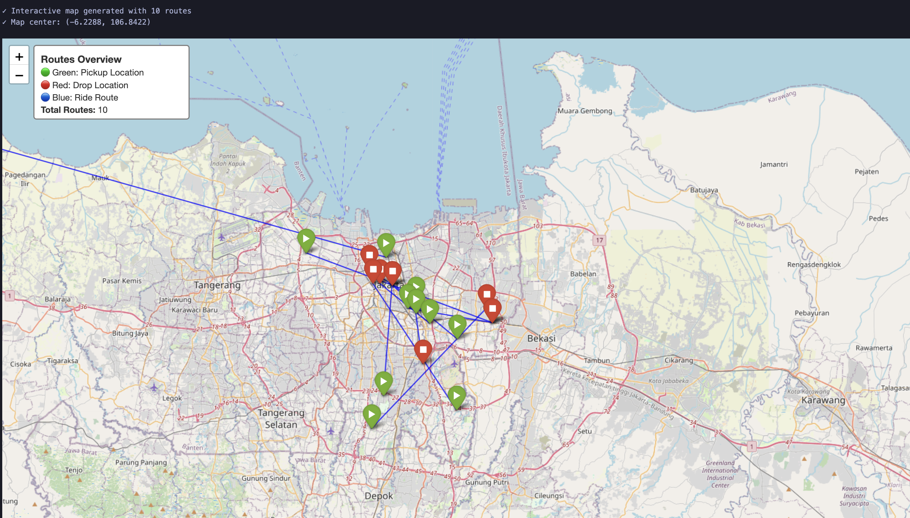
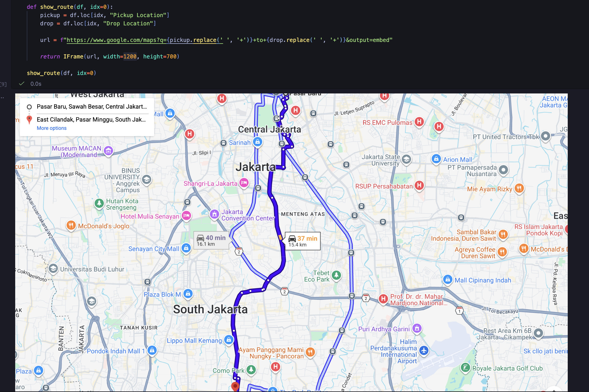
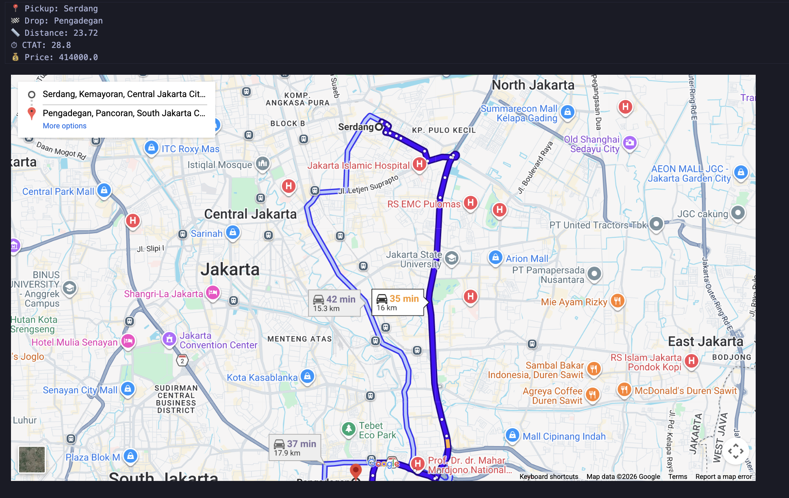
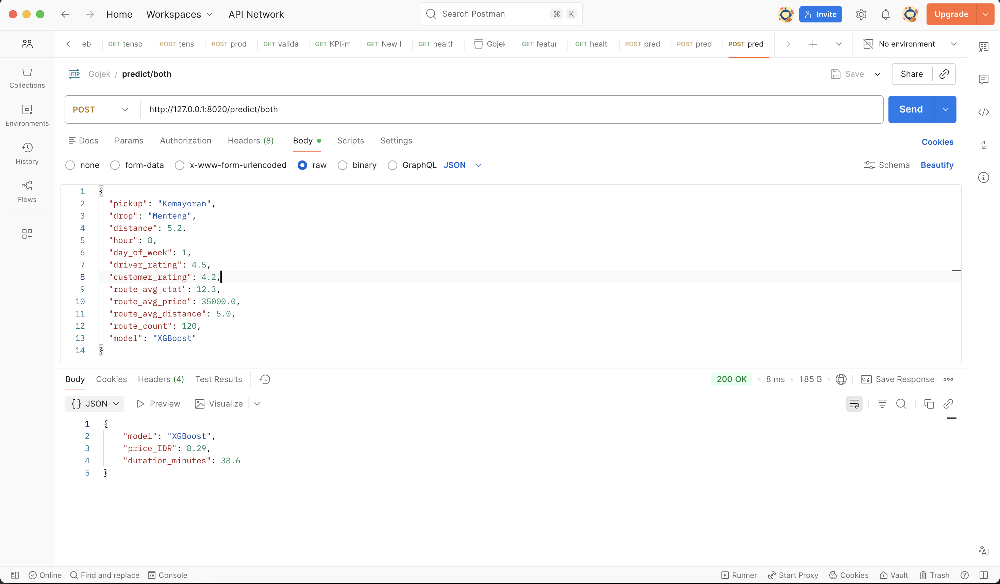

## 🚖 Taxi trip enterprise project

## 🎯 Goals project

## Build taxi tracking for similar in tracking ride
- Maps tracking - Google maps
- Machine learning to ensure the project is enterprise production for better learnt
- Cluster fast way tracks
- Artificial Intelligence for the best method recommendation in taxi trip ways
- Navigating with prediction on the road with proper
    - Best price chosen
    - Best track on the road
- Get models to predict and embed
    - Machine learning models (Supervised learning ML models)
    - Deep learning models (Neural Network models)
- Build Google Maps in a notebook cell Google maps display enterprise for taxi trip distance
    - Interactive map generated with 10 routes
    
    - google maps previews
    
    - plot heatmap for maps traffic
    
    - prediction with features on the trip
    
- Deploy to API -> Prediction result on API
    
- 